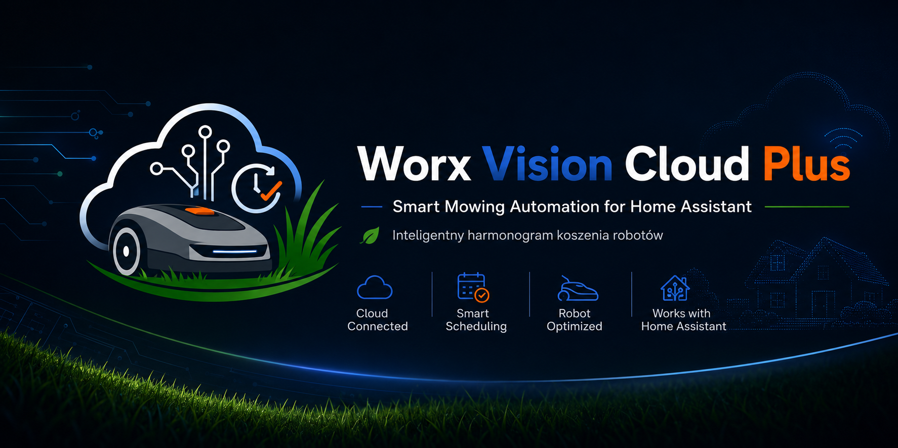

<p align="center">
  
</p>

Home Assistant automation blueprints for Worx Vision Cloud PLUS / Landroid Vision mowers.

This repository is separated from the custom integration repository on purpose:

- integration code lives in [`worx_vision_cloud_plus_github`](https://github.com/SmartServicePL/worx_vision_cloud_plus_github),
- automations and blueprints live here.

Prepared by **Smart Service**.

## Import Blueprint

[](https://my.home-assistant.io/redirect/blueprint_import/?blueprint_url=https%3A%2F%2Fgithub.com%2FSmartServicePL%2Fworx_vision_cloud_plus_automation%2Fblob%2Fmain%2Fblueprints%2Fautomation%2Fworx_vision_cloud_plus%2Fsmart_mowing_schedule.yaml)

Manual import URL:

```text
https://github.com/SmartServicePL/worx_vision_cloud_plus_automation/blob/main/blueprints/automation/worx_vision_cloud_plus/smart_mowing_schedule.yaml
```

## Smart Mowing Schedule

The smart mowing blueprint estimates grass growth with a cool-season turf Growth Potential (GP) temperature model combined with rain, optional soil moisture, sunlight/UV data, and optional irrigation/fertilization corrections. It stores the estimated grass growth in an `input_number`, tracks the last full mowing cycle in an `input_datetime`, stores the next planned mowing time in another `input_datetime`, and starts the mower only when the lawn needs mowing. The automatic start threshold is tuned for robotic mowing: frequent light cuts, usually around `2-4.5 mm` of estimated growth depending on the selected cutting height. The one-third blade rule is treated as a safety limit, not as the normal start threshold. In automatic mode it searches forecast-based mowing slots and prefers dry grass, no rain, and a sensible time inside the selected window preset. Every planned smart mowing start sends one Worx Vision Cloud PLUS one-time mowing command with edge cutting enabled; if Home Assistant does not see the mower leave the dock, the same command is sent one more time.

Before enabling this blueprint, disable the mowing schedule in the WORX app so Home Assistant is the only scheduler controlling mower starts.

Before creating the automation from the blueprint, create three Home Assistant helpers:

- `input_number` for estimated grass growth, for example `input_number.worx_estimated_grass_growth_mm`.
- `input_datetime` for the last full mowing cycle, for example `input_datetime.worx_last_full_mow`.
- `input_datetime` for the next planned mowing time, for example `input_datetime.worx_next_planned_mow`.

Documentation:

- [Smart mowing setup](docs/smart-mowing-schedule.md)
- [Helper package example](docs/smart-mowing-helpers-package.yaml)

Blueprint path:

```text
blueprints/automation/worx_vision_cloud_plus/smart_mowing_schedule.yaml
```

## Requirements

- Home Assistant 2025.1.0 or newer.
- Worx Vision Cloud PLUS integration `1.0.0` or newer installed from [`SmartServicePL/worx_vision_cloud_plus_github`](https://github.com/SmartServicePL/worx_vision_cloud_plus_github).
- A `lawn_mower` entity for the mower.
- The one-time mowing service from the Worx Vision Cloud PLUS integration.
- Battery and rain entities from the integration.
- Temperature, rain/weather and sunlight/UV sources from Home Assistant.
- Optional automatic-irrigation setting for lawns that are watered regularly.
- Three helpers: estimated grass growth, last full mowing, next planned mowing.
- Optional soil moisture sensor.

## Support

If this project helps you, you can support Smart Service:

[Donate via Revolut](https://revolut.me/smartserwis)

## Privacy

Do not publish Home Assistant storage files, access tokens, serial numbers, raw API responses or screenshots showing exact garden coordinates.
