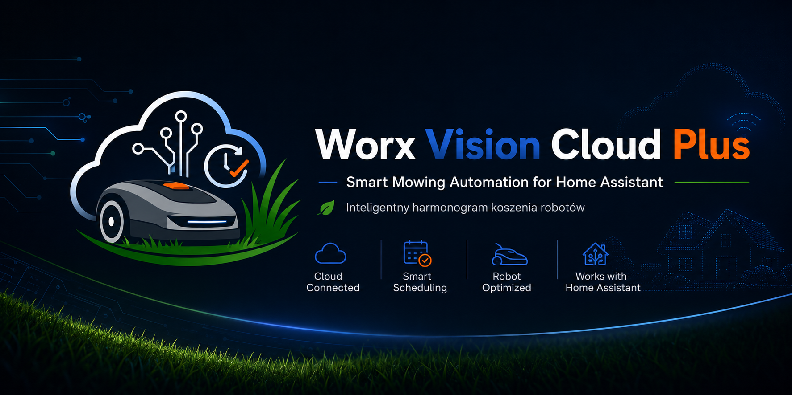

<p align="center">
  
</p>

Smart mowing automation for Worx mowers in Home Assistant, focused on Worx Vision / RTK models and still compatible with older wired Worx mowers.

This blueprint replaces a rigid mowing timetable with a weather-aware schedule. It estimates grass growth, chooses a dry and sensible mowing window, starts edge cutting first, then starts normal mowing after the mower returns to the dock and recharges. Vision / RTK mowers are monitored through automatic recharge and resume cycles until they really finish; older wired Worx mowers can still use a calculated runtime.

This repository is separated from the custom integration repository on purpose:

- integration code lives in [`worx_vision_cloud_plus_github`](https://github.com/SmartServicePL/worx_vision_cloud_plus_github),
- automations and blueprints live here.

Prepared by **Smart Service**.

## Import Blueprint

[](https://my.home-assistant.io/redirect/blueprint_import/?blueprint_url=https%3A%2F%2Fgithub.com%2FSmartServicePL%2Fworx_vision_cloud_plus_automation%2Fblob%2Fmain%2Fblueprints%2Fautomation%2Fworx_vision_cloud_plus%2Fsmart_mowing_schedule.yaml)

Manual import URL:

```text
https://github.com/SmartServicePL/worx_vision_cloud_plus_automation/blob/main/blueprints/automation/worx_vision_cloud_plus/smart_mowing_schedule.yaml
```

## What It Does

- Estimates grass growth once a day with a Growth Potential (GP) model that uses the conditions of the whole coming day (mean temperature, peak UV and rainfall from the hourly forecast) instead of a single dawn reading.
- Uses local rain, temperature, sunlight/UV, optional outdoor humidity and soil moisture, irrigation and fertilization settings.
- Accepts a separate optional `weather` entity for hourly planning.
- Selects the best mowing time in the chosen time window, avoiding rain, wet grass and unsafe temperatures throughout the next three hours.
- Runs edge cutting first, waits for the mower to return to the dock and recharge to at least `80%`, then starts normal one-time mowing.
- Lets the user choose the mower cycle type: Vision / RTK self-finishing mowing or older wired Worx timed mowing.
- Keeps three helpers updated: estimated grass growth, last full mowing, and next planned mowing.
- Detects manual mowing started from the WORX app and resets the growth estimate only after the full mowing cycle is confirmed.
- Rechecks live measurements, Worx Cloud rain delay and the hourly forecast before normal mowing begins after the edge pass.

## Mowing Logic

The automatic start threshold is tuned for robotic mowing. Instead of waiting for tall grass, the blueprint prefers frequent light cuts, usually around `2-4.5 mm` of estimated growth depending on the selected cutting height. The one-third blade rule is kept as a safety limit, not as the normal target.

Every mowing time is produced by one shared planner: the daily grass-growth update, a blocked start, an interrupted cycle, a completed cycle and a manual mowing all use the same calculation, so every notification shows the time that is actually saved in the helper. The selected slot must have no forecast rain and must keep temperature and humidity safe during the expected mowing horizon. A time planned for today is not moved by background forecast changes; a time planned for a later day is re-evaluated with a fresh forecast at the next daily update. By default, mowing is allowed only between `10 C` and `25 C`. If it is too hot, the blueprint first looks for the nearest cooler time on the same day. Without FiatLux it searches until `22:00`; with the accessory confirmed it can continue searching through the night until `05:00`.

For the best local decisions, use your own weather station or local outdoor sensors for measured conditions. **MeteoFusion HA** is the recommended hourly forecast source: the blueprint automatically recognizes its `smart_service.weather.v1` context, uses live rain rate and daily rainfall, and prefers forecast slots with higher MeteoFusion confidence. A standard `weather` entity such as Tomorrow.io remains supported. If no hourly forecast is selected, the blueprint uses the configured mowing window and validates live conditions at start time.

Forecast rain is used while choosing the original mowing time, so the saved plan prefers a genuinely dry forecast window. At the saved start time a working binary rain sensor becomes authoritative: a dry sensor allows the cycle to begin even if the forecast changed after planning. If the sensor changes to rain during edge or normal mowing, the robot is sent back to the dock. When the selected rain sensor is unavailable, MeteoFusion or the standard weather entity remains the protective fallback.

The post-rain drying delay (3 hours, 6 hours after heavy rain) is counted from the moment the selected rain sensor turned dry, and only when at least `0.2 mm` of rain was measured since midnight, so trace precipitation and sensor noise cannot postpone mowing. The delay is respected by the daily plan, by retries and at the start itself.

Long hourly forecasts are capped to the planning horizon, so providers such as Pirate Weather can return many forecast records without making the Home Assistant template exceed its output limit.

If actual rain, wet grass, an unsafe measured temperature or the mower state blocks the saved start, or the cycle is interrupted, the blueprint plans a new concrete time from that moment and explains the reason in the notification. Retries after non-weather blockers are spaced out (for example two hours when the mower is not in the dock), so the same obstacle does not produce a notification every few minutes. Notifications are limited to the daily grass-growth calculation, a real postponement at start, mowing start, and mowing completion or interruption. They are short: a confirmed `Termin koszenia` (mowing time) when the forecast confirms good conditions, otherwise a `Termin ponownego sprawdzenia` (next check time) with a one-sentence reason.

## Before You Start

Disable the mowing schedule in the WORX app so Home Assistant is the only scheduler controlling mower starts.

Create three Home Assistant helpers before creating the automation:

- `input_number` for estimated grass growth, for example `input_number.worx_estimated_grass_growth_mm`.
- `input_datetime` for the last full mowing cycle, for example `input_datetime.worx_last_full_mow`.
- `input_datetime` for the next planned mowing time, for example `input_datetime.worx_next_planned_mow`.

Documentation:

- [Smart mowing setup](docs/smart-mowing-schedule.md)
- [Helper package example](docs/smart-mowing-helpers-package.yaml)

Blueprint path:

```text
blueprints/automation/worx_vision_cloud_plus/smart_mowing_schedule.yaml
```

## Requirements

- Home Assistant 2025.1.0 or newer.
- Worx Vision Cloud PLUS integration `1.3.1` or newer installed from [`SmartServicePL/worx_vision_cloud_plus_github`](https://github.com/SmartServicePL/worx_vision_cloud_plus_github).
- A `lawn_mower` entity for the mower.
- The one-time mowing service from the Worx Vision Cloud PLUS integration.
- Battery and rain entities from the integration.
- Temperature, rain/weather and sunlight/UV sources from Home Assistant.
- Optional automatic-irrigation setting for lawns that are watered regularly.
- Three helpers: estimated grass growth, last full mowing, next planned mowing.
- Optional soil moisture sensor.

## Support

If this project helps you, you can support Smart Service:

[Donate via Revolut](https://revolut.me/smartserwis)

## Privacy

Do not publish Home Assistant storage files, access tokens, serial numbers, raw API responses or screenshots showing exact garden coordinates.
